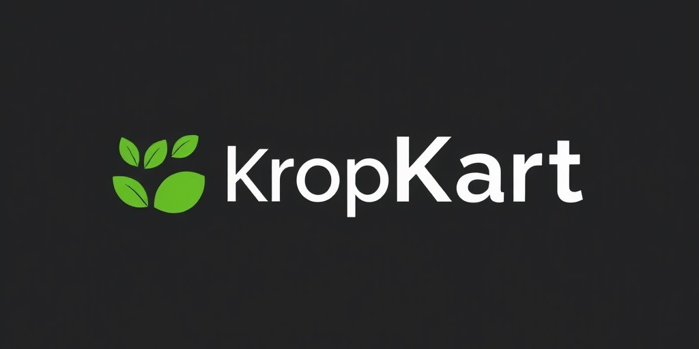

# 🌾 KropKart 🌱
**India's Smartest B2B Marketplace for Agriculture!**

[](https://github.com/Vipul04s/KropKart/fork)

---

## 🚀 Project Overview

**KropKart** is a frontend-only project that showcases a **smart agriculture B2B marketplace**. It connects **farmers, suppliers, and businesses**, providing a platform for seamless transactions with features like **pre-ordering**, **real-time logistics**, and **weather forecasting** to enhance productivity.

✨ **Key Features**:
- 🛒 **B2B Marketplace**: Wide selection of agricultural products and seasonal crops.
- 📦 **Pre-order System**: Reserve products for future delivery.
- 🌦️ **Weather & Logistics**: Real-time tracking for smarter farming.
- ⭐ **Seasonal Stars**: Handpicked products from local farms.

---

## 🌟 Features

### **KropKart Marketplace**:
- **Seasonal Picks**: Featured seasonal products such as **mangoes**, **apples**, and **mushrooms**.
- **Shop Now**: Easy-to-navigate platform for buying agricultural goods.
- **Logistics Integration**: Real-time tracking for product deliveries.
- **Weather Forecasting**: Plan farming operations with up-to-date weather forecasts.

---

## 🛠️ Technologies Used

| **Technology**      | **Description**                              |
|---------------------|----------------------------------------------|
| HTML5               | Structuring the content and layout.          |
| CSS3                | Styling with custom responsive designs.      |
| JavaScript          | Adding interactivity and dynamic elements.   |
| Swiper.js           | Creating carousels and sliders for products. |
| Unicons             | Icon library for sleek and modern icons.     |

This is purely a **frontend project** with no backend or database integration, focusing on the **UI/UX** and **interactive elements** of an agriculture marketplace.

---

## 📸 Screenshots

### KropKart Homepage


### Product Logo


---

## 🛠️ Setup and Installation

To run this project locally, follow these steps:

1. **Clone the repository**:
   ```bash
   git clone https://github.com/Vipul04s/KropKart.git
   cd KropKart


---

## 🔒 Usage Permission

Before using this project, please obtain permission from the author. You can reach out via email:

- **Email**: singhvipul.1401s@gmail.com

Your understanding and compliance are greatly appreciated!


## 📢 Acknowledgements

- **Swiper.js**: Used for creating carousels and sliders for the marketplace.
- **Unicons**: Provided the icons used throughout the project for a sleek and modern design.
- Special thanks to [OpenAI’s GPT](https://openai.com/) for assisting in project planning and development.

---


   
